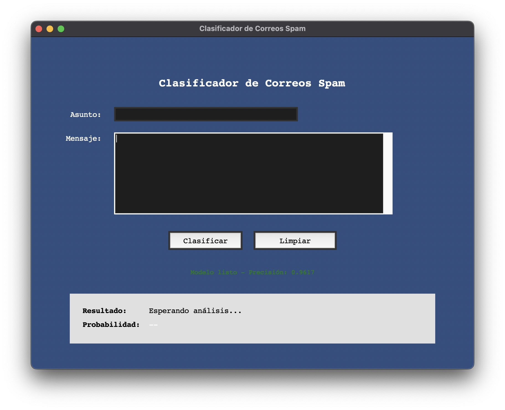
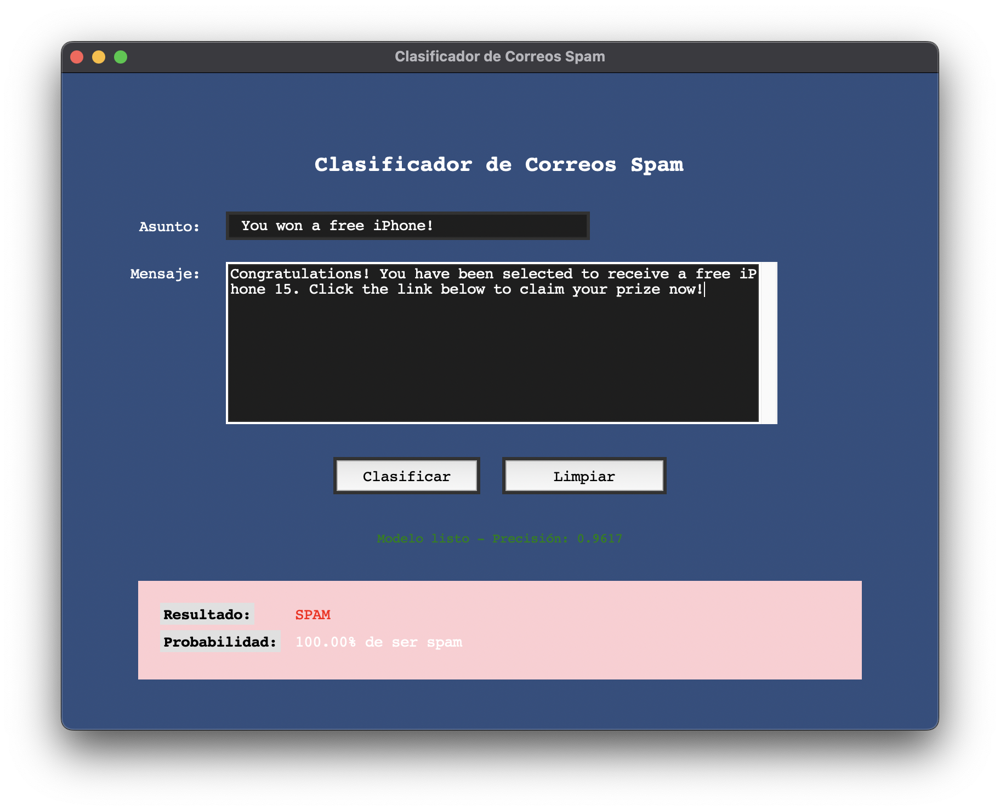
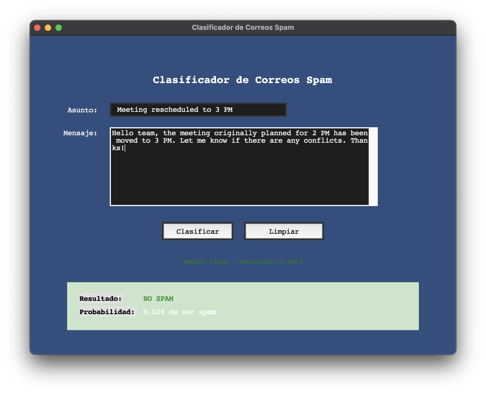

# INTELIGENCIA ARTIFICIAL 9-10

## TAREA 8
### Detección de Spam con razonamiento monótono
## Objetivo:
- Desarrollar un sistema para detectar correos electrónicos no deseados
(spam) utilizando razonamiento monótono

## Funcionamiento
Esta Tabla muestra un resumen breve de lo que se consideraria correo spam y lo que no.
Haciendo las pruebas con base al entrenamiento con el data set. concluimos que el clasificador detecta mas facilmente como spam
cuando el mensaje contiene

- Ofertas excesivamente buenas
- Urgencia y presión para actuar rápidamente
- Solicitud de información personal
- Múltiples signos de exclamación y mayúsculas
- Enlaces sospechoso

Los correos no spam suelen contener en el mensaje
- No solicitar información sensible de manera sospechosa
- Tener un propósito claro y legítimo
- Utilizar un tono profesional 

## Utilizacion del modelo de bayes
- Se entrena un modelo Naïve Bayes con datos de correos spam y no spam.

- Se convierte el texto en números usando CountVectorizer.

- El modelo aprende qué palabras son más frecuentes en los correos spam.

- Cuando el usuario
## Interfaz 
La interfaz del programa tiene lo siguiente
- Asunto: Aqui va el asunto del correo
- mensaje: El texto del correo

- boton de clasificar: una ves llenado el asunto y el mensaje se puede clasificar
- boton de limpiar

- Resultado: si el correo es spam o no 
- probabilidad: probabilidad de ser spam

## Captura de ejemplos de correo spam y no spam

### SPAM

### NO SPAM

